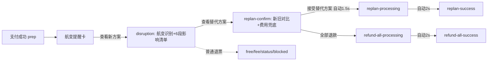

# 航变联动退改主链路（融合版）

## 目标

把“主动退票”重构为“航变触发·全链路免费退改”主链路，并满足你提出的核心要求：

- 退改数据必须和正向链路左对齐
- 行程数据以正向链路 `plans[selectedPlanId]` 为唯一主数据源
- 保留普通退票分支，但不抢航变主链路表达

## 场景定义

### 商品形态：全链路打包一键下单

以 `balanced` 方案为例，一单包含 6 段：

| 段 | mode | 路线 | 价格 |
|----|------|------|------|
| s1 | 打车 | 东莞金域名苑 → 东莞南城候机楼 | ¥40 |
| s2 | 跨城大巴 | 东莞南城候机楼 → 香港国际机场 T1 | ¥199 |
| s3 | 步行（中转） | 香港国际机场 T1 内 | ¥0 |
| s4 | 飞机 | 香港机场 T1 → 吉隆坡 KUL T1（国泰 CX725） | ¥1211 |
| s5 | 步行 | 吉隆坡 T1 → 打车点 | ¥0 |
| s6 | 接机打车 | 吉隆坡 T1 → 雪邦酒店 | ¥30 |

总价 **¥1545**（`plans[0].totalPrice`），一次支付一次出票。

### 触发场景：航变被动触发

不是用户主动退票，而是平台/航司推送：

- 航班取消（例：CX725 台风取消）
- 航班大延误导致后续接驳不可用
- 航班时刻变更导致全链路衔接失败

### 核心卖点

> 一程航变，全程自动改好，不加钱。

## 关键原则：退改数据完全从正向链路派生

现有 `refund.js` 内硬编码订单（杭州-北京 / CA1805）与当前项目不一致，必须替换为 plan 派生。

### 必须落实

- 退改页所有核心信息均来自 `state.selectedPlanId -> plans[*]`
- 默认 `selectedPlanId` 兜底为 `balanced`
- 受影响段、替代航班、接机调整、退款金额等全部由 `plan.fullLegs` 计算

### 数据工厂（新增）

在 `hongkong_journey/prototypes/main-demo-v5/src/data.js` 新增：

```js
export function buildDisruption(plan) {
  const flightLeg = plan.fullLegs.find((l) => l.mode === "飞机");
  const pickupLeg = plan.fullLegs.find((l) => l.mode === "接机");
  const busLeg = plan.fullLegs.find((l) => /大巴|高铁|机场快线/.test(l.mode));

  return {
    reason: "台风天气，航司取消航班",
    originalFlight: flightLeg,
    affected: [busLeg?.id, flightLeg?.id, pickupLeg?.id].filter(Boolean),
    impactList: [], // 6 段逐段状态
    alternative: { code: "国泰 CX727", time: "15:20→19:25", priceDelta: 0 },
    newPickupTime: "20:45",
    refundTotal: plan.totalPrice,
    fee: 0,
  };
}
```

## 用户旅程（主链路 + 全退分支）



## 改造范围

### 1) 数据层

文件：`hongkong_journey/prototypes/main-demo-v5/src/data.js`

- 新增 `buildDisruption(plan)`
- 新增 `replanProcessSteps`
- 新增 `refundAllProcessSteps`

### 2) 状态层

文件：`hongkong_journey/prototypes/main-demo-v5/src/state.js`

- 扩展 `refundFlow`：
  - `disruption`
  - `replan-confirm`
  - `replan-processing`
  - `replan-success`
  - `refund-all-processing`
  - `refund-all-success`
  - 保留 `free/fee/submitted/status/blocked/failed`
- 新增 `replanProgress`

### 3) 行为层

文件：`hongkong_journey/prototypes/main-demo-v5/src/actions.js`

- 扩展 `startRefundFlow` 状态白名单
- 新增：
  - `viewReplanCompare()`
  - `confirmReplan()`（自动进处理->成功）
  - `chooseFullRefund()`（自动进处理->成功）

### 4) 视图层

文件：`hongkong_journey/prototypes/main-demo-v5/src/views/refund.js`

- 删除硬编码 `ORDER`
- 新增 `getOrderSummary(state)` 从 `plans[selectedPlanId]` 派生
- 重构航变主链路卡片：
  - `renderDisruptionAlert`
  - `renderImpactList`（6 段逐段状态）
  - `renderReplanCompare`（大巴/机票/接机三行对比）
  - `renderShieldBar`（费用变化 ¥0）
  - `renderProcessingCard`
  - `renderSuccessCard`
- 普通退票分支继续保留，但同样改成 plan 派生数据

### 5) 行前入口

文件：`hongkong_journey/prototypes/main-demo-v5/src/views/prep.js`

- 在 `success-card` 上方新增航变提醒卡（模拟推送）
- CTA：
  - 查看新方案
  - 查看影响明细
- `success-card` 增加“航变保障已开启”权益文案

### 6) 样式

文件：`hongkong_journey/prototypes/main-demo-v5/styles/components.css`

- 新增：
  - `.disruption-alert`
  - `.refund-impact-list` / `.refund-impact-row`
  - `.refund-replan-compare` / `.refund-replan-row`
  - `.refund-shield-bar`
  - `.refund-processing-card`
  - `.refund-success-card`

## Dock 与入口改造

### Demo Dock

文件：`正向支付链路.html`

退改入口精简为单一节点：

- 航变退票（`refund-disruption`）

### 退改入口页

文件：`退改链路.html`

- 默认跳转参数改为：`?refund=disruption`

## 验收标准

- 从正向支付链路进入行前页可看到航变提醒卡
- 航变主链路首屏一屏内看懂：触发原因、影响范围、平台已处理内容、费用是否变化
- “接受替代方案”自动：确认 -> 处理中 -> 成功
- “全部退款”自动：确认 -> 处理中 -> 成功（退款金额来自 plan）
- Dock 可直达主链路与普通退票分支
- 普通退票能力保留，且数据已与正向链路对齐（不再出现杭州-北京）
- 浏览器无 JS 报错，手机框内无文本遮挡或按钮溢出

## 实施顺序

1. 数据底座：`buildDisruption(plan)` + `getOrderSummary(state)`
2. `state/actions` 新状态与自动流转
3. `refund.js` 主链路卡片重构
4. `prep.js` 接入航变入口
5. `components.css` 样式补齐
6. `正向支付链路.html` Dock 重排 + `退改链路.html` 默认参数
7. 本地全链路验证
